# Project 1 - GPU-Based AI Service Infrastructure (On-Prem)

## Overview

This project demonstrates how to build a GPU-enabled AI service infrastructure on an on-premise Ubuntu server.

The environment was designed and implemented from scratch using Docker, NVIDIA GPU runtime, and FastAPI.  
It simulates a real enterprise internal AI inference server.

---

## Objectives

- Build a GPU-ready Linux server environment
- Enable GPU access inside Docker containers
- Deploy an AI API service using FastAPI
- Validate GPU runtime in both host and container environments
- Establish a foundation for future Kubernetes / MLOps expansion

---

## System Environment

| Component | Spec |
|----------|------|
| OS | Ubuntu 24.04 LTS |
| CPU | AMD Ryzen 7 7800X3D |
| GPU | NVIDIA RTX 5070 Ti |
| RAM | 128GB |

---

## Tech Stack

- Ubuntu Linux
- Docker Engine
- Docker Compose
- NVIDIA Driver
- NVIDIA Container Toolkit
- Python
- FastAPI
- PyTorch CUDA Runtime

---

## Implemented Tasks

### 1. Linux Server Preparation
- System update
- Essential package installation
- Network / storage verification

### 2. NVIDIA GPU Runtime Setup
- Installed NVIDIA Driver
- Verified GPU status with `nvidia-smi`
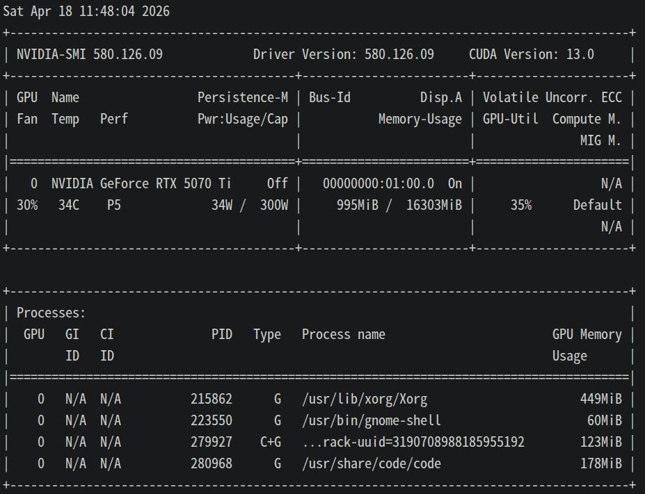

### 3. Docker Environment Setup
- Installed Docker Engine
- Configured Docker service auto-start
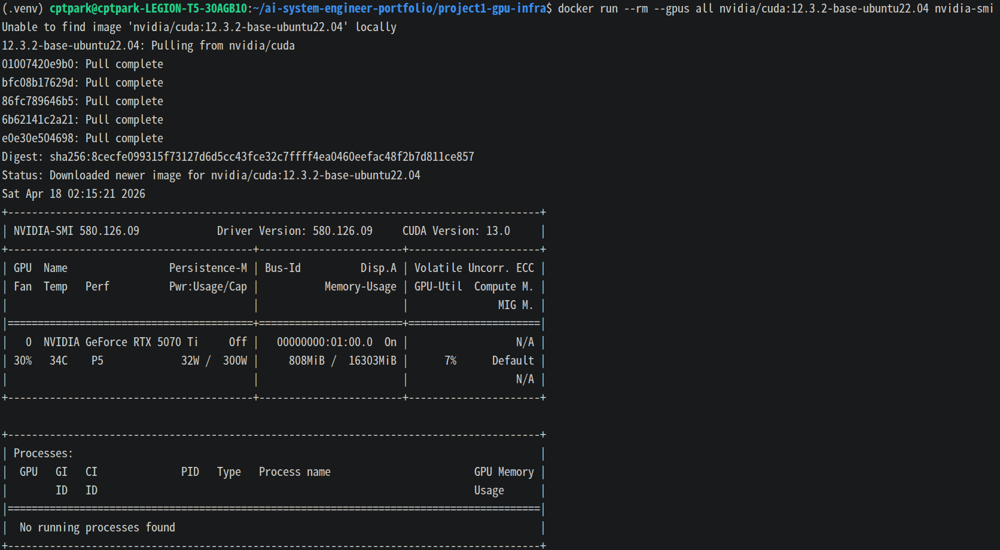

### 4. GPU Container Runtime
- Installed NVIDIA Container Toolkit
- Enabled GPU access inside containers
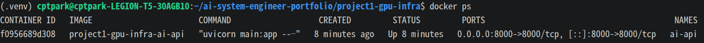

### 5. AI API Deployment
- Built FastAPI container
- Implemented API endpoints:
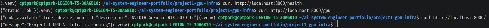

/health
/gpu
/predict
/docs

### GPU API Response

The API successfully detects the GPU inside the Docker container.
``` JSON 
{
  "cuda_available": true,
  "device_count": 1,
  "device_name": "NVIDIA GeForce RTX 5070 Ti",
  "torch_device": "cuda"
}
```

### Real Model Inference API

Implemented a real AI inference API using FastAPI + Hugging Face Transformers.

### Features
* Sentiment Analysis API
* Hugging Face pre-trained model loading
* JSON response output
* Swagger UI support

### Example Request

``` Bash
curl -X POST http://localhost:8000/predict \
  -H "Content-Type: application/json" \
  -d '{"text":"I really like this project."}'
  ```

 ### Example Response (CPU fallback mode)

 ``` JSON
{
  "label": "POSITIVE",
  "score": 0.999,
  "model_name": "distilbert-base-uncased-finetuned-sst-2-english",
  "device": "cpu"
}
```

## Troubleshooting
### Issue 1: Transformers / PyTorch Version Conflict

When using an older PyTorch image:
```
Disabling PyTorch because PyTorch >= 2.4 is required but found 2.3.1
```

### Solution

Updated Docker base image:
``` dockerfile
FROM pytorch/pytorch:2.6.0-cuda12.6-cudnn9-runtime
```

### Issue 2: CUDA Kernel Compatibility Error

During GPU inference testing:
```
RuntimeError: CUDA error: no kernel image is available for execution on the device
```

This indicates that the RTX 5070 Ti architecture is newer than the CUDA kernels included in the current runtime image.

### Temporary Resolution
    Verified GPU detection through /gpu
    Switched inference pipeline to CPU fallback mode
    Kept infrastructure validation as completed

### API Health Check
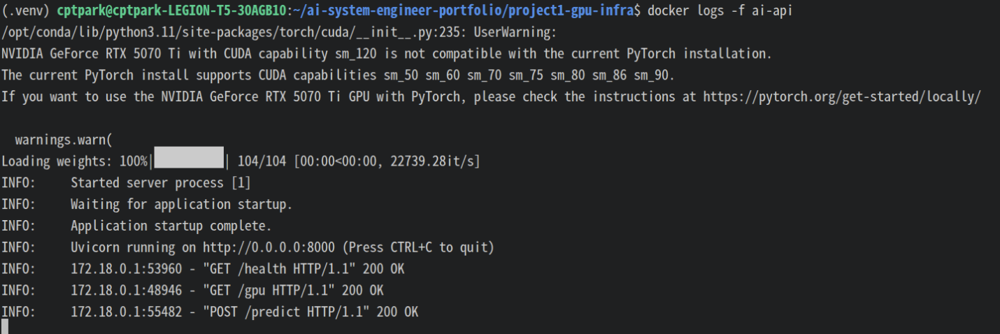

### Result
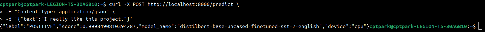

## Key Learnings
  * Linux server setup for AI infrastructure
  * Docker-based AI service deployment
  * GPU runtime configuration
  * Hugging Face model serving
  * Troubleshooting GPU compatibility issues
  * CPU fallback design for production resilience

## Step 3 - Production-Style API Refactoring

The inference API was refactored to support more production-oriented features.

### Added Features

- Single prediction endpoint: `/predict`
- Batch prediction endpoint: `/predict/batch`
- Request logging middleware
- Global error handling
- Environment-variable based model configuration
- CPU fallback mode for runtime stability

### API Endpoints

| Method | Endpoint | Description |
|--------|----------|-------------|
| GET | `/health` | Health check |
| GET | `/gpu` | GPU runtime status |
| POST | `/predict` | Single text inference |
| POST | `/predict/batch` | Batch text inference |
| GET | `/docs` | Swagger UI |

### Runtime Configuration
The model can be changed without modifying source code.
``` yaml
environment:
  - APP_MODEL_NAME=distilbert-base-uncased-finetuned-sst-2-english
  - APP_INFERENCE_DEVICE=cpu
  - APP_MAX_BATCH_SIZE=16
```

### Single Prediction Response
``` JSON
{
  "result": {
    "text": "I really like this project.",
    "label": "POSITIVE",
    "score": 0.999
  },
  "model_name": "distilbert-base-uncased-finetuned-sst-2-english",
  "device": "cpu"
}
```


### Batch Prediction Example
``` Bash
curl -X POST http://localhost:8000/predict/batch \
  -H "Content-Type: application/json" \
  -d '{"texts":["I really like this project.","This system is disappointing.","The API works well."]}'
```

### Batch Prediction Response
``` JSON
{
  "results": [
    {
      "text": "I really like this project.",
      "label": "POSITIVE",
      "score": 0.999
    },
    {
      "text": "This system is disappointing.",
      "label": "NEGATIVE",
      "score": 0.998
    },
    {
      "text": "The API works well.",
      "label": "POSITIVE",
      "score": 0.999
    }
  ],
  "model_name": "distilbert-base-uncased-finetuned-sst-2-english",
  "device": "cpu",
  "batch_size": 3
}
```

### Operational Improvement
The application now separates responsibilities into multiple modules:
```
main.py            - API routes and middleware
model_service.py   - Model loading and inference logic
config.py          - Environment-based settings
schemas.py         - Request and response schemas
logging_config.py  - Logging setup
```

### Runtime Configuration
The model can be switched without modifying source code.
``` YAML
environment:
  - APP_MODEL_NAME=distilbert-base-uncased-finetuned-sst-2-english
  - APP_INFERENCE_DEVICE=cpu
  - APP_MAX_BATCH_SIZE=16
  ```

Screenshot Evidence
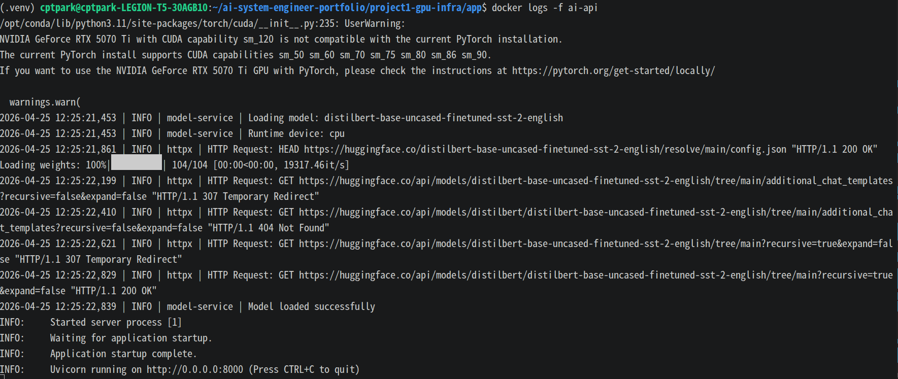
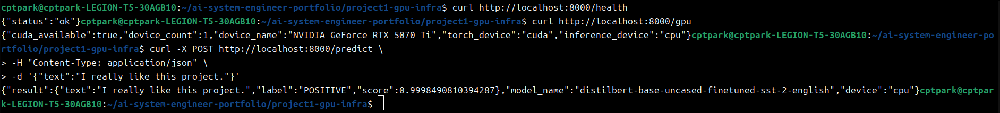
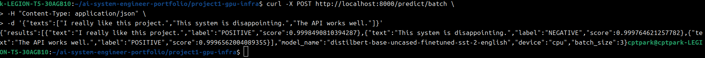
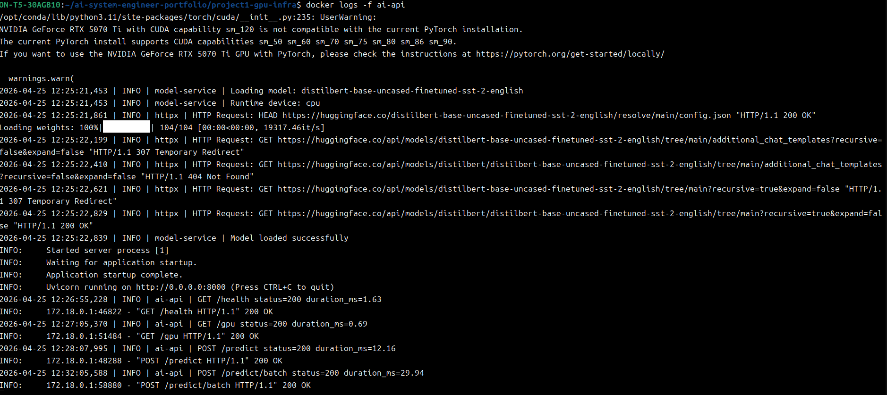
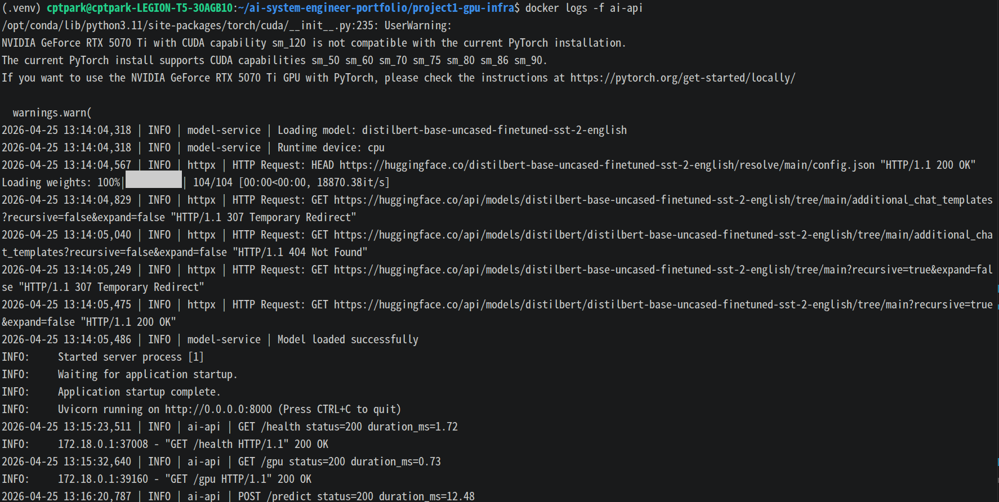
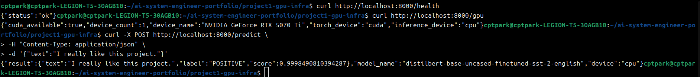
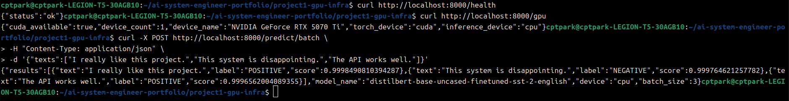
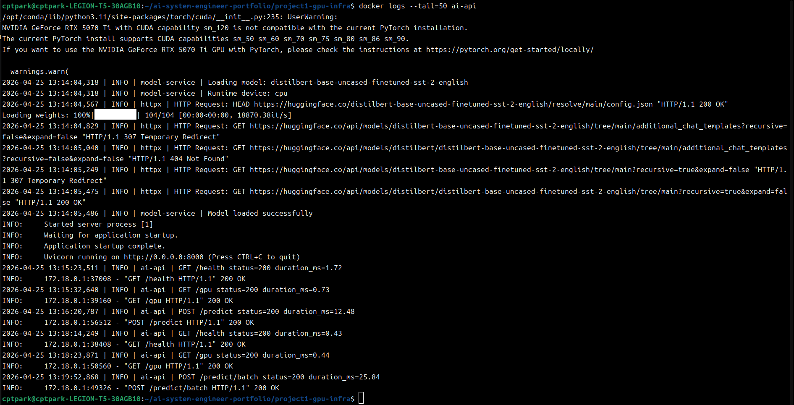

## Step 4 - Nginx Reverse Proxy

The API service was exposed through Nginx reverse proxy.

### Architecture

``` text

Client
↓
Nginx (Port 80)
↓
FastAPI (Port 8000)

```

### Features
  - Hide internal application port
  - Route external traffic through Nginx
  - Production-style service exposure

### Example
``` Bash

curl http://localhost/health

```

### Screenshots
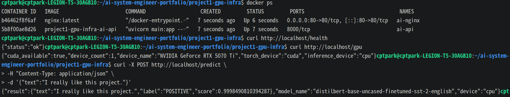

## Step 5 - Portfolio Website

The API service was secured using HTTPS with SSL termination at Nginx.

GitHub Pages: https://cptpark01.github.io/ai-system-engineer-portfolio/

This page provides a high-level overview of the AI System Engineer Portfolio.

### Architecture

```text
Client
 ↓ HTTPS
Nginx SSL Termination
 ↓ HTTP
FastAPI
```

### Features
  - HTTPS enabled
  - SSL certificate installed
  - Domain routing configured
  - HTTP to HTTPS redirect

### Example
``` Bash
curl https://cptpark01.github.io/health
```

## Monitoring Dashboard

Implemented real-time monitoring dashboard using Grafana.

### Panels

- Request Count
- Response Time
- Error Count

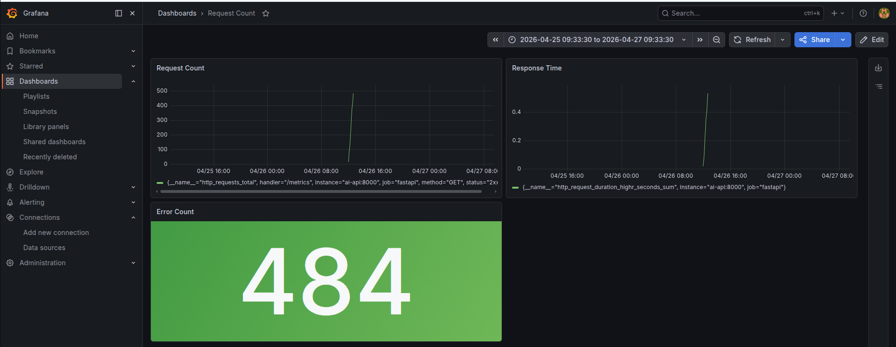

## GPU Runtime Validation

The system successfully detects the NVIDIA RTX 5070 Ti GPU inside the container.

```json
{
  "cuda_available": true,
  "device_name": "NVIDIA GeForce RTX 5070 Ti"
}  
```

However, CUDA tensor execution fails due to a kernel compatibility issue with the current PyTorch runtime.
```
RuntimeError: CUDA error: no kernel image is available for execution on the device
```

### Root Cause
The RTX 5070 Ti is a newer GPU architecture that is not fully supported by the current stable PyTorch CUDA runtime.

### Design Decision
  - The ```/predict``` endpoint uses CPU fallback for stability
  - GPU availability is validated via ```/gpu```
  - CUDA execution attempts are exposed via ```/gpu-test```

### Result
The system demonstrates:
  - GPU detection capability
  - Runtime compatibility validation
  - Graceful fallback strategy

## GPU Inference Validation (RTX 5070 Ti)

Initial attempts using stable PyTorch failed due to CUDA kernel compatibility issues.

```text
CUDA error: no kernel image is available for execution on the device
```

To resolve this, the system was upgraded to:
  - CUDA 12.8
  - PyTorch Nightly build

This enabled successful GPU inference.

### Result
```JSON
{
  "inference_device": "cuda"
}
```

The ```/predict``` endpoint now performs real GPU-based inference.

### Screenshot
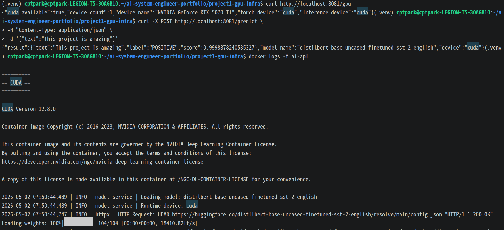