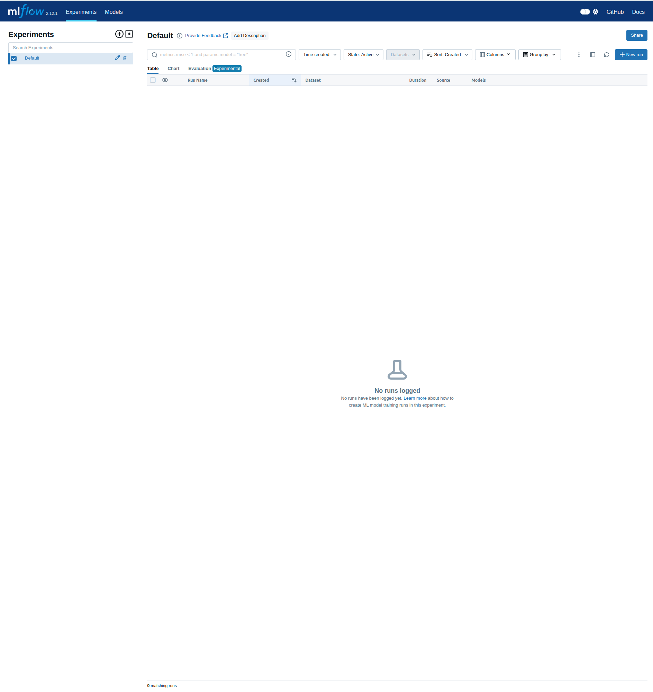
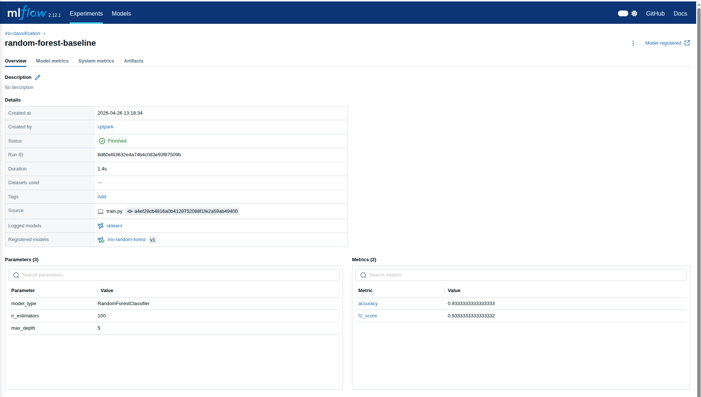
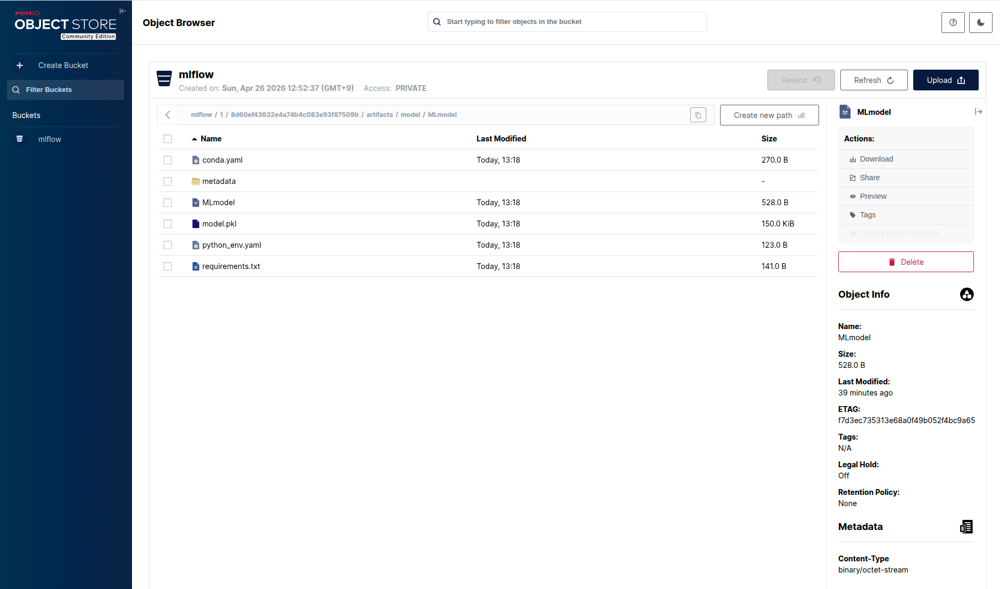
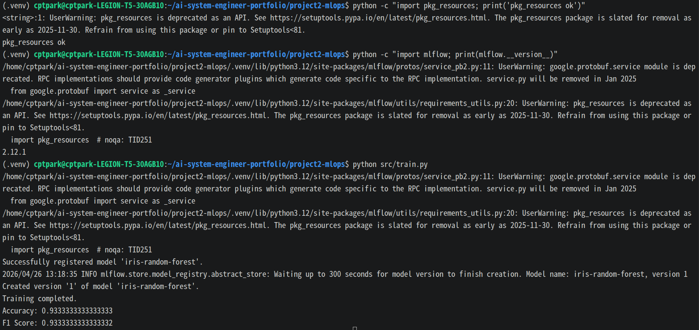

# Project 2 - MLOps End-to-End Pipeline

## Overview

This project demonstrates an end-to-end MLOps pipeline using MLflow and MinIO.

The goal is to build a production-style machine learning lifecycle workflow:

- Train a model
- Track experiments
- Store artifacts
- Register models
- Deploy models

---

## Architecture

```text
Developer
   ↓
Train Model
   ↓
MLflow Tracking
   ↓
MinIO Artifact Storage
   ↓
Model Registry
   ↓
Deploy API
```

### Tech Stack
    - Ubuntu Linux
    - Docker / Docker Compose
    - Python
    - MLflow
    - MinIO
    - Scikit-learn
    - Pandas
    - Boto3

### Step 1 - MLflow + MinIO Setup

Implemented MLflow tracking server and MinIO object storage.

### Services 
| Service | Port | Description |
|----------|------|------------|
| MinlO API | 9000 | Object Storage API |
| MinlO Console | 9001 | Web UI |
| Mlflow UI | 5000 | Experiment Tracking UI |

### Docker Compose
``` YAML
services:
  minio:
    image: minio/minio

  mlflow:
    image: ghcr.io/mlflow/mlflow:v2.12.1
```

### MinlO Console
URL:
```
http://localhost:9001
```

Login:
```
minio / miniopassword
```

Created bucket:
```
mlflow
```
### MLflow UI
URL
```
http://localhost:5000
```

Tracks
    - Experiments
    - Runs
    - Metrics
    - Parameters
    - Artifacts

### Screenshots



## Step 2 - Model Training & Experiment Tracking
Trained a machine learning model and logged the experiment to MLflow.

### Model
Used:
```
RandomForestClassifier
```

Dataset:
```
Iris Dataset
```

### Logged Parameters
    - model_type
    - n_estimators
    - max_depth

### Logged Metrics
    - accuracy
    - f1_score

### Example Training Command
``` Bash
python src/train.py
```

Example output;
```
Training completed.
Accuracy: 0.93
F1 Score: 0.93
```

### Model Registry
Registered model:
```
iris-random-forest
```

## Troubleshooting
### Issue 1 - MLflow Version Mismatch
Problem:
```
/api/2.0/mlflow/logged-models 404 Not Found
```

Cause:
MLflow client version was newer than server version.

Solution:
``` Bash
pip install mlflow==2.12.1
```

### Issue 2 - pkg_resources Missing
Problem: 
```
ModuleNotFoundError: No module named 'pkg_resources'
```

Cause:
setuptools missing or broken in Python venv.

Solution:
``` Bash
pip install "setuptools<81" wheel
```

or recreate ```.venv```.

### Screenshots




## Key Learnings
    - MLOps architecture design
    - MLflow experiment tracking
    - MinIO object storage integration
    - Model artifact management
    - Model Registry workflow
    - Environment/version troubleshooting