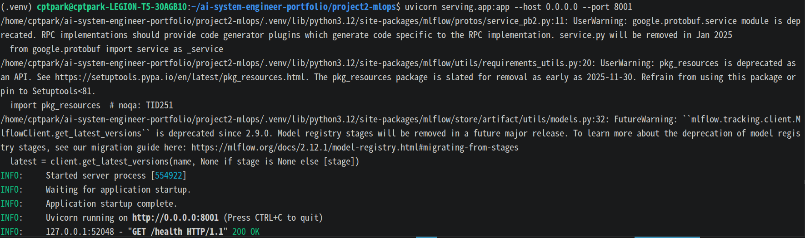
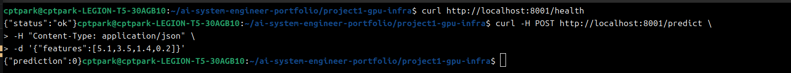
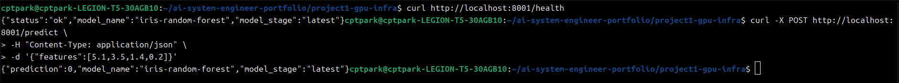

# Project 2 - MLOps End-to-End Pipeline

## Overview

This project demonstrates an end-to-end MLOps pipeline using MLflow and MinIO.

The goal is to build a production-style machine learning lifecycle workflow:

- Train a model
- Track experiments
- Store artifacts
- Register models
- Deploy models

---

## Architecture

```text
Developer
   ↓
Train Model
   ↓
MLflow Tracking
   ↓
MinIO Artifact Storage
   ↓
Model Registry
   ↓
Deploy API
```

### Tech Stack
    - Ubuntu Linux
    - Docker / Docker Compose
    - Python
    - MLflow
    - MinIO
    - Scikit-learn
    - Pandas
    - Boto3

### Step 1 - MLflow + MinIO Setup

Implemented MLflow tracking server and MinIO object storage.

### Services 
| Service | Port | Description |
|----------|------|------------|
| MinlO API | 9000 | Object Storage API |
| MinlO Console | 9001 | Web UI |
| Mlflow UI | 5000 | Experiment Tracking UI |

### Docker Compose
```YAML
services:
  minio:
    image: minio/minio

  mlflow:
    image: ghcr.io/mlflow/mlflow:v2.12.1
```

### MinlO Console
URL:
```
http://localhost:9001
```

Login:
```
minio / miniopassword
```

Created bucket:
```
mlflow
```
### MLflow UI
URL
```
http://localhost:5000
```

Tracks
    - Experiments
    - Runs
    - Metrics
    - Parameters
    - Artifacts

### Screenshots


## Step 2 - Model Training & Experiment Tracking
Trained a machine learning model and logged the experiment to MLflow.

### Model
Used:
```
RandomForestClassifier
```

Dataset:
```
Iris Dataset
```

### Logged Parameters
    - model_type
    - n_estimators
    - max_depth

### Logged Metrics
    - accuracy
    - f1_score

### Example Training Command
```Bash
python src/train.py
```

Example output;
```
Training completed.
Accuracy: 0.93
F1 Score: 0.93
```

### Model Registry
Registered model:
```
iris-random-forest
```

## Troubleshooting
### Issue 1 - MLflow Version Mismatch
Problem:
```
/api/2.0/mlflow/logged-models 404 Not Found
```

Cause:
MLflow client version was newer than server version.

Solution:
```Bash
pip install mlflow==2.12.1
```

### Issue 2 - pkg_resources Missing
Problem: 
```
ModuleNotFoundError: No module named 'pkg_resources'
```

Cause:
setuptools missing or broken in Python venv.

Solution:
```Bash
pip install "setuptools<81" wheel
```

or recreate ```.venv```.

### Screenshots


## Key Learnings
    - MLOps architecture design
    - MLflow experiment tracking
    - MinIO object storage integration
    - Model artifact management
    - Model Registry workflow
    - Environment/version troubleshooting


 ## Step 3 - Model Serving API

Deployed a registered MLflow model as a production-style FastAPI inference API.

The serving API loads the model directly from MLflow Model Registry and downloads artifacts from MinIO object storage.

---

### Architecture

```text
Client
 ↓
FastAPI
 ↓
MLflow Model Registry
 ↓
MinIO Artifact Storage
 ↓
Loaded Model
```

### API Endpoints
| Method | Endpoint | Description |
|----------|------|------------|
| GET | /health | Health check |
| POST | /predict | Inference API |

### Example Request
```Bash
curl -X POST http://localhost:8001/predict \
-H "Content-Type: application/json" \
-d '{"features":[5.1,3.5,1.4,0.2]}'
```

### Example Response
```JSON
{
  "prediction": 0
}
```

### Implementation
The serving API performs:
    - Connect to MLflow Tracking Server
    - Load latest registered model
    - Access MinIO artifact storage
    - Run infrerence via FastAPI endpoint

### Key Environment Variables
```python
os.environ["AWS_ACCESS_KEY_ID"] = "minio"
os.environ["AWS_SECRET_ACCESS_KEY"] = "miniopassword"
os.environ["MLFLOW_S3_ENDPOINT_URL"] = "http://localhost:9000"
```

These are required to access model artifiacts stored in MinIO.

### Troubleshooting

### Issue - NoCredentialsError
Problem:
```
botocore.exceptions.NoCredentialsError: Unable to locate credentials
```

Cause:
Serving API could not access MinIO artifacts.

Solution:
Set MinIO credentials in ```serving/app.py```.

### Screenshots



### Key Learning
    - Model Registry based deployment
    - Artifact retrieval from object storage
    - FastAPI model serving
    - Environment variable based credential handling
    - Production-style model deployment


## Step 4 - Containerized Model Serving API

Containerized the FastAPI serving API and deployed it with Docker Compose.

The serving API now runs as an independent container and automatically loads the latest model from MLflow Model Registry.

---

### Architecture

```text
Client
 ↓
FastAPI Serving API Container
 ↓
MLflow Tracking / Registry
 ↓
MinIO Artifact Storage
```

### Services
| Service | Port | Description |
|----------|------|------------|
| MinIO API | 9000 | Object Storage |
| MinIO Console | 9001 | Web UI |
| MLflow UI | 5000 | Tracking / Registry |
| Serving API | 8001 | Inference API |

### Dockerized Serving API
The serving API was containerized using Docker.

### Dockerfile
```dockerfile
FROM python:3.11-slim

WORKDIR /app

COPY serving/requirements.txt .
RUN pip install --no-cache-dir --upgrade pip \
    && pip install --no-cache-dir "setuptools<81" wheel \
    && pip install --no-cache-dir -r requirements.txt

COPY serving/app.py .

CMD ["uvicorn", "app:app", "--host", "0.0.0.0", "--port", "8001"]
```

### Environment Variables
```
MLFLOW_TRACKING_URI=http://mlflow:5000
MODEL_NAME=iris-random-forest
MODEL_STAGE=latest
AWS_ACCESS_KEY_ID=minio
AWS_SECRET_ACCESS_KEY=miniopassword
MLFLOW_S3_ENDPOINT_URL=http://minio:9000
```

### Example Request
```Bash
curl -X POST http://localhost:8001/predict \
-H "Content-Type: application/json" \
-d '{"features":[5.1,3.5,1.4,0.2]}'
```

### Example Response
```JSON
{
  "prediction": 0,
  "model_name": "iris-random-forest",
  "model_stage": "latest"
}
```

### Troubleshooting

### Issue 1 - pkg_resources Missing in Container
Problem:
```
ModuleNotFoundError: No module named 'pkg_resources'
```

Cause:
Incompatible setuptools version.

Solution:
```dockerfile
pip install "setuptools<81"
```

### Issue 2 - Regisitered Model Not Found
Problem:
```
RESOURCE_DOES_NOT_EXIST:
Registered Model with name=iris-random-forest not found
```

Cause:
Model was not registered in MLflow Registry.

Solution:
```Bash
python src/train.py
docker restart mlops-serving-api
```

### Screenshots


### Key Learnings
    - Dockerized ML model serving
    - MLflow Registry integration
    - MinIO artifact retrieval
    - Service-to-service communication
    - Container environment troubleshooting