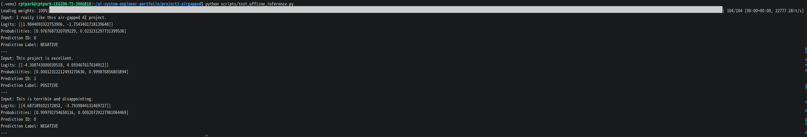
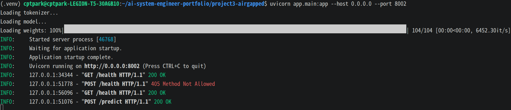
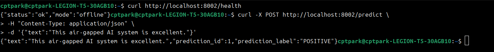

# Project 3 - Air-Gapped AI System

## Overview

This project demonstrates how to build and operate an AI inference system in a fully air-gapped (offline / isolated) environment.

The goal is to run AI models without internet access by pre-downloading model files and loading them locally.

This architecture is useful for:

- Military environments
- Government networks
- Financial institutions
- Manufacturing facilities
- Security-sensitive organizations

---

## Objectives

- Download and package AI models in an online environment
- Transfer models into an isolated environment
- Run inference without internet access
- Build a local AI API for internal users
- Simulate air-gapped deployment scenarios

---

## Architecture

```text
Online Environment
   ↓
Download Model
   ↓
Offline Model Package
   ↓
Air-Gapped Network
   ↓
Local Model Server
   ↓
Internal User
```

### Tech Stack
   - Ubuntu Linux
   - Python
   - Transformers
   - PyTorch
   - Hugging Face Hub

## Step 1 - Model Download and Local Packaging
Downloaded an open-source Hugging Face model and saved it locally.

### Model Used
```
distilbert-base-uncased-finetuned-sst-2-english
```
This is a sentiment analysis model.

### Local Storage Path
```
./models/sentiment-model
```

### Download Script
```Bash
python scripts/download_model.py
```

### Expected Files
```
config.json
pytorch_model.bin
tokenizer.json
vocab.txt
```

### Key Learning
The model can be packaged in advance and transferred into an offline environment.

## Step 2 - Offline Model Loading Test

Validated that the model can run without internet access.

The model was loaded only from local files.

### Offline Mode Settings
```Python
os.environ["TRANSFORMERS_OFFLINE"] = "1"
os.environ["HF_HUB_OFFLINE"] = "1"
```

### Local Load Option
```Python
local_files_only=True
```

### Offline Inference Test
```Bash
python scripts/test_offline_inference.py
```

Example output:
```
Input: I really like this air-gapped AI project.
Prediction Label: NEGATIVE
```
### Screenshots


Note:
The model prediction itself may vary, but the purpose of this step is to verify offline inference.

### Validation Result
Confirmed:
   - No external Hugging Face Hub access
   - No internet dependency
   - Local model loading successful
   - Inference execution successful

### Current Progress
```
Step 1: Model download and local packaging
Step 2: Offline model loading test
```

## Step 3 - Offline FastAPI Inference API

Built a FastAPI inference API that runs entirely offline.

### Endpoints

GET /health

POST /predict

### Example

```bash
curl -X POST http://localhost:8002/predict \
-H "Content-Type: application/json" \
-d '{"text":"This air-gapped AI system is excellent."}'
```

### Result
The API performs inference using only local model files.


