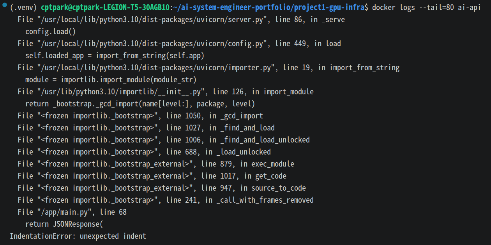
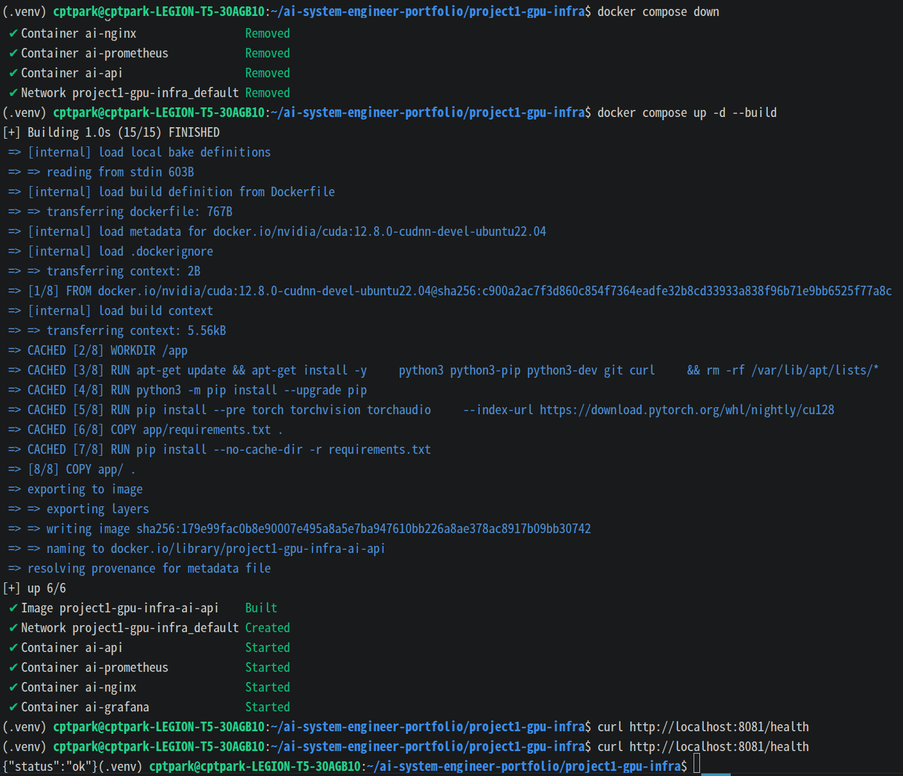
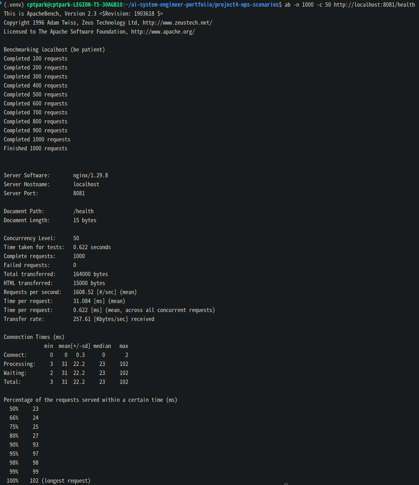
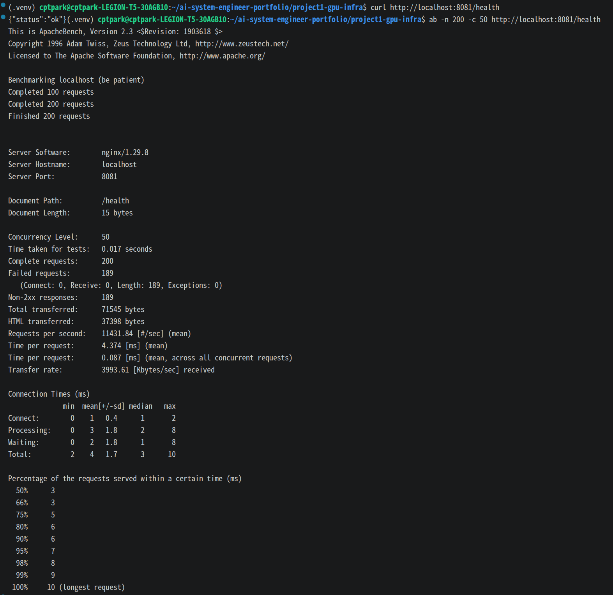
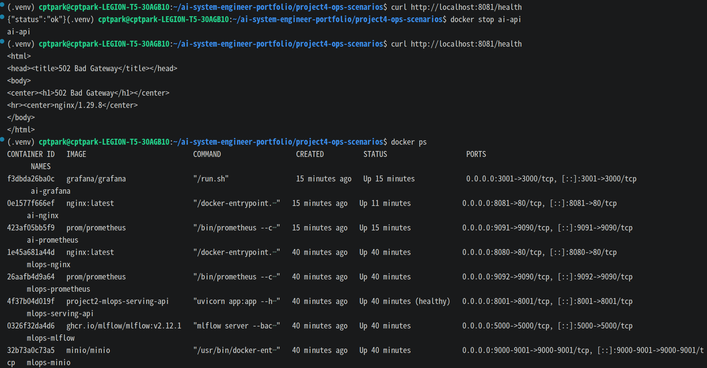
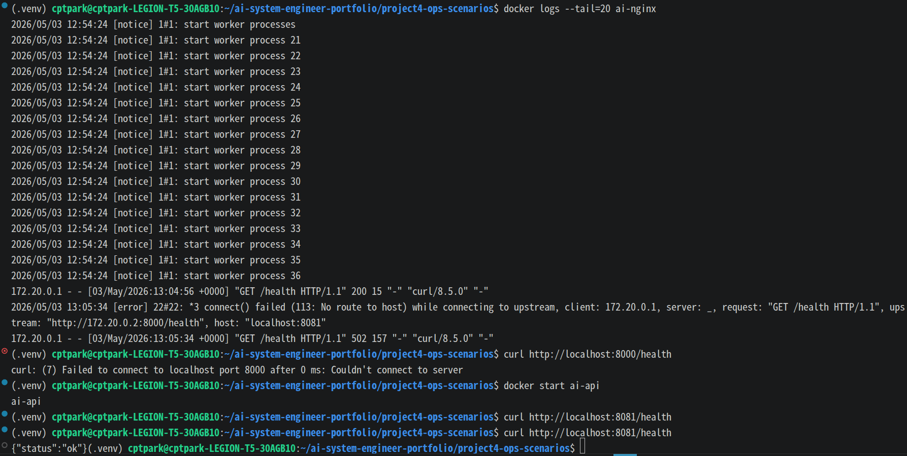

## Scenario 1 - API Container Crash (Code Error)

### Summary

The API service failed due to a Python syntax error.

### Symptoms

- Nginx returned 502 Bad Gateway
- API container was continuously restarting

### Detection

```Bash
docker ps
```

Restarting (1)

```Bash
docker logs ai-api
```

IndentationError: unexpected indent



### Root Cause
A syntax error in main.py caused the FastAPI server to fail at startup.

### Resolution
	- Fixed indentation in Python code
	- Rebuilt container

```Bash
docker compose up -d --build
```

### Verification
```Bash
curl http://localhost:8081/health
```



### Lessons Learned
Application-level errors can propagate to infrastructure-level failures (502).


## Scenario 2 - High Latency Under Load

### Summary
Simulated high traffic load against the AI API and observed latency increase.

### Reproduction

```bash
ab -n 1000 -c 50 http://localhost:8081/health
```

### Detection
	- Grafana request rate increased
	- Grafana latency panel increased
	- Docker logs showed high request volume
	- ```ab``` reported increased time per request



### Resolution
The service recovered after the load test stopped.

### Preventive Actions
	- Add rate limiting
	- Add horizontal scaling
	- Add resource limits
	- Add latency-based alerting


## Scenario 3 - Auto Recovery

### Summary
Simulated container crash and verified automatic restart.

### Reproduction

```bash
docker kill ai-api
```

### Result
	- Container restarted automatically
	- Temporary 502 observed
	- Service recovered without manual intervention

### Key Feature
	- Docker restart policy
	- Health check validation


## Scenario 4 - Rate Limiting / Traffic Control

### Summary
Simulated excessive traffic and protected the backend API using Nginx rate limiting.

### Reproduction

```bash
ab -n 200 -c 50 http://localhost:8081/health
```

### Root Cause
Too many concurrent requests were sent to the API endpoint.

### Resolution
Applied Nginx rate limiting.

```Nginx
limit_req_zone $binary_remote_addr zone=api_limit:10m rate=5r/s;
limit_req_status 429;

location / {
    limit_req zone=api_limit burst=10 nodelay;
    proxy_pass http://ai-api:8000;
}
```

### Verification
```Bash
for i in {1..50}; do
  curl -s -o /dev/null -w "%{http_code}\n" http://localhost:8081/health
done
```

Expected result:
	- Normal requests return 200
	- Excessive requests return 429




### Preventive Actions
	- Keep rate limiting at reverse proxy layer
	- Add Grafana alert for 429 spikes
	- Tune rate and burst values based on traffic profile
	- Add autoscaling in Kubernetes for long-term scalability

### Lessons Learned
Rate limiting protects backend services from traffic spikes and prevents overload.


## Scenario 5 - Nginx 502 Bad Gateway

### Summary
Simulated backend API failure and observed 502 error from Nginx.

### Reproduction

```bash
docker stop ai-api
```

### Detection
	- Nginx returned 502
	- Docker showed API container stopped
	- Logs indicated upstream connection failure




### Root Cause
Backend API container was not running.

### Resolution
```Bash
docker start ai-api
```

### Verification
```Bash
curl http://localhost:8081/health
```



### Lessons Learned
Reverse proxy depends entirely on upstream availability.
Infrastructure-level errors can be caused by application-level failures.

